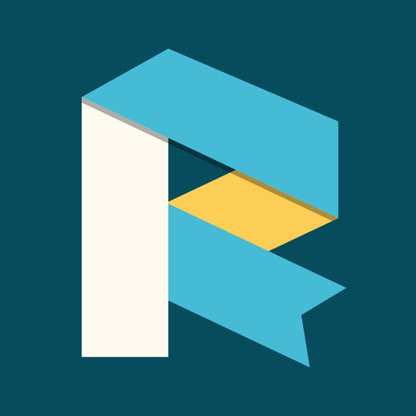
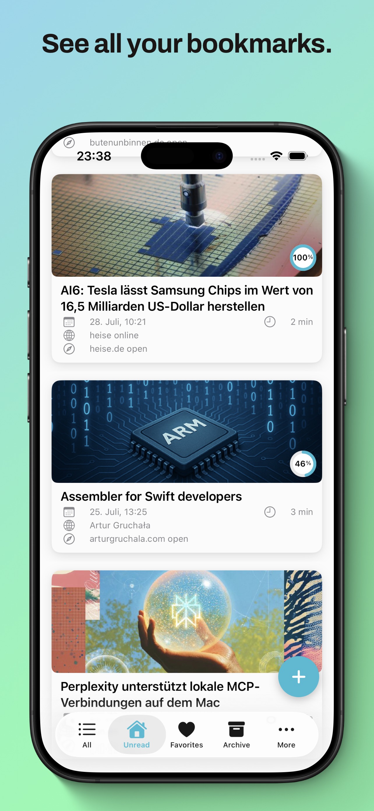
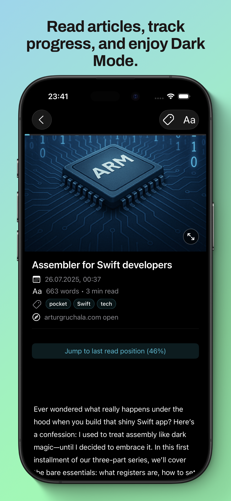
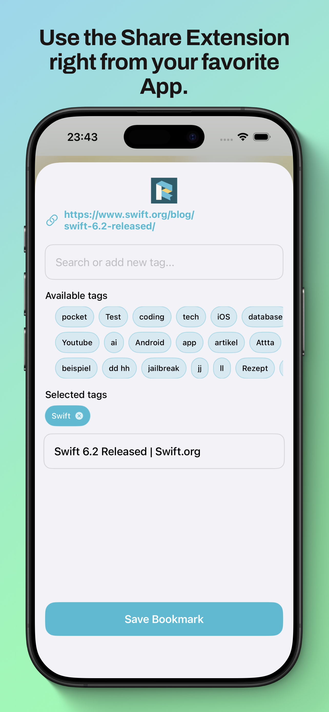
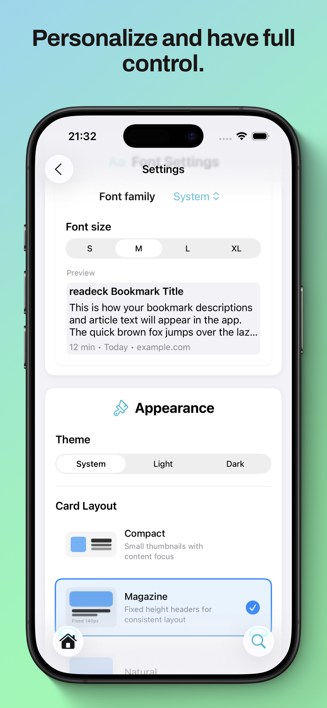
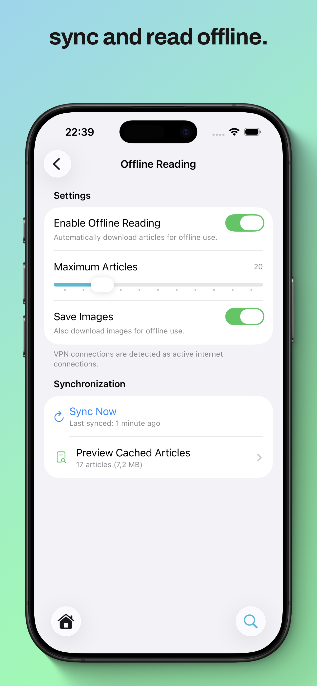
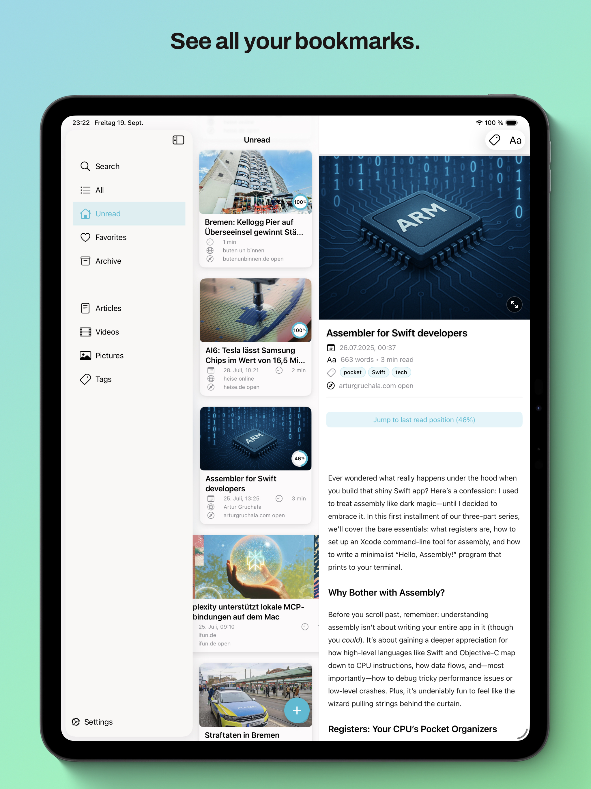
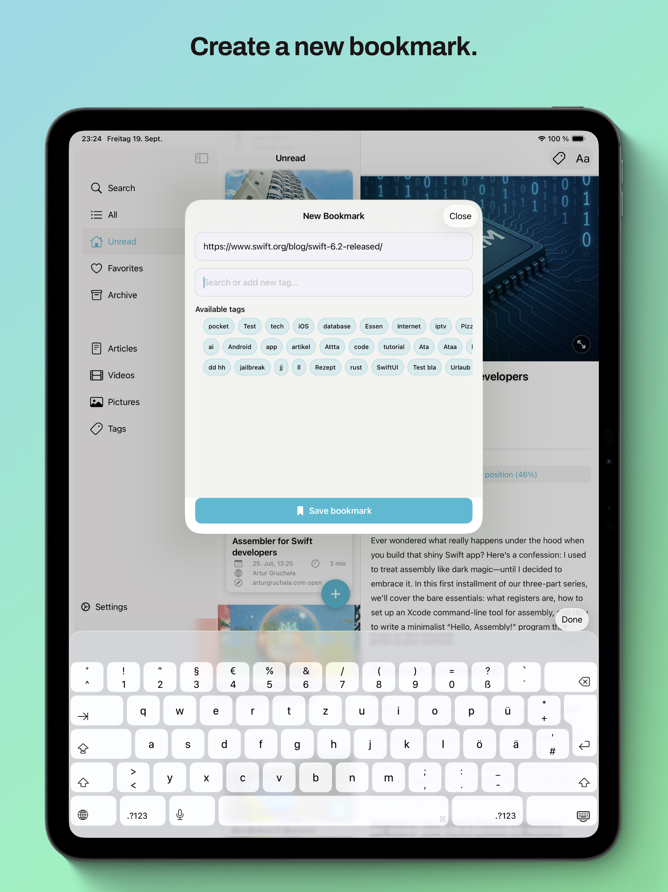
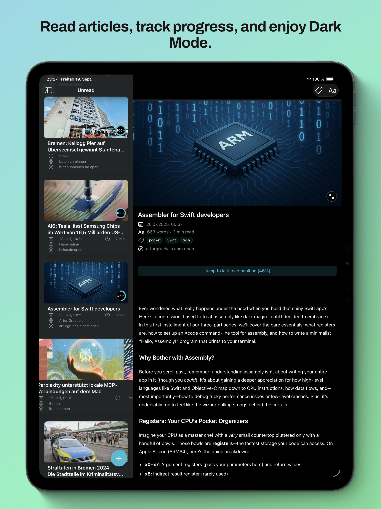
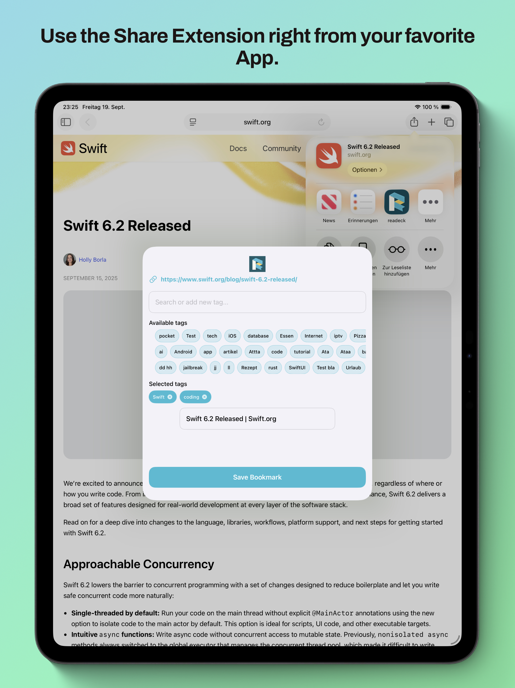

# Readeck for iOS

**Your read-it-later library, native on iPhone and iPad.**

A client for [Readeck](https://readeck.org), the self-hosted bookmark manager.
Save articles from anywhere, read them distraction free, and take them offline.

 

## Why Readeck for iOS

- **Made for reading.** A clean reader with your font, size, margins and color theme, and progress that follows you.
- **Save from anywhere.** The share extension adds a page from Safari or any other app in two taps.
- **Works offline.** Articles are cached on the device, so the train or the plane is no problem.
- **Your server, your data.** The app only talks to your own Readeck server, no tracking, no third party account.

## Features

**Reading**
- Classic and modern reader, with progress as a line, a ring around the Dynamic Island or a percent pill
- Fonts, text size, margins, line height, 7 color themes and custom CSS
- Highlights and annotations, tap a highlight to remove it, shake to undo
- Export any article as PDF, share a public Readeck link or have your server send it by email
- Choose what happens after archiving: stay, open the next article or go back to the list

**Library**
- All, Unread, Favorites, Archive, Articles, Videos and Pictures
- Search, labels and swipe actions, fast even with thousands of labels
- Optional unread count on the app icon
- Full iPad support with a multi column split view

**Sync and offline**
- Offline reading with cached images, saved articles open instantly
- Bookmarks saved while the server is unreachable sync once it is back
- OAuth login, VPN and private network support (for example Tailscale), self-signed certificates
- Custom HTTP headers for setups behind an auth proxy

Available in English, German and Swedish.
See the [release notes](readeck/UI/Resources/RELEASE_NOTES.md) for what landed in each version.

<b>iPad screenshots</b>

 

## Getting started

1. Install the app from the [App Store](https://apps.apple.com/app/readeck/id6748764703), or join the [TestFlight beta](https://testflight.apple.com/join/cV55mKsR) for early access to new features
2. Enter the URL of your Readeck server and sign in
3. Your bookmarks load right away

To save a page, share it from Safari or any other app and pick Readeck in the share sheet.

<b>Server setup notes</b>

 

Local network and VPN addresses (for example Tailscale) also work over plain HTTP and with self-signed certificates.
For a public domain, your Readeck server needs HTTPS, since iOS does not allow plain HTTP there.

Custom HTTP headers are sent with every API request, which helps when Readeck runs behind a proxy like Pangolin.
`Content-Type` and `Authorization` are managed by the app and cannot be overridden.

## Feedback and contributing

Bugs, crashes and ideas are welcome through TestFlight, as an issue, or by email at hi@ilyashallak.de.
Pull requests too, see [Contribute.md](Contribute.md) for how to get started.

The Readeck server itself lives on [Codeberg](https://codeberg.org/readeck/readeck).

## License

MIT, see [LICENSE](LICENSE).

Made by [Ilyas Hallak](https://ilyashallak.de).
More about the app on [ilyashallak.de/readeck](https://ilyashallak.de/readeck/).
