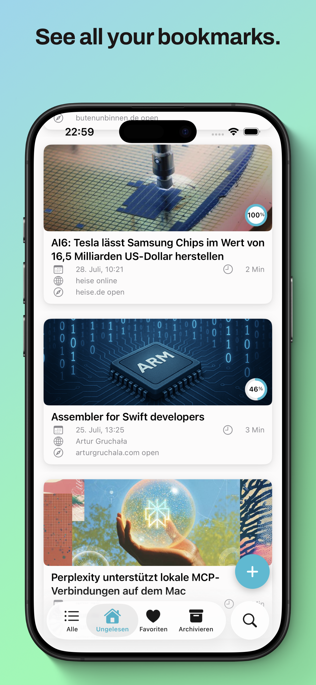
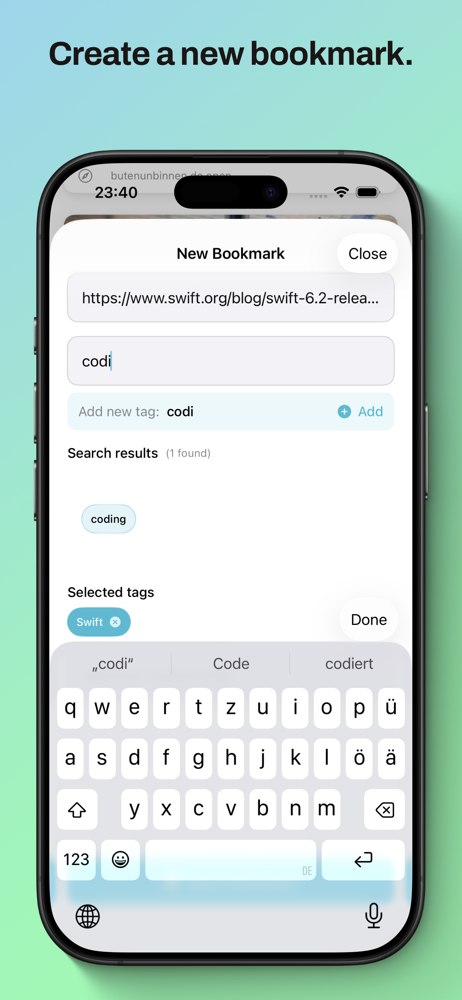
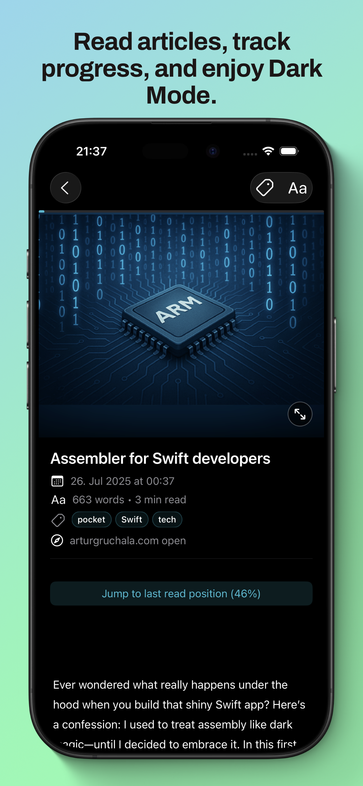
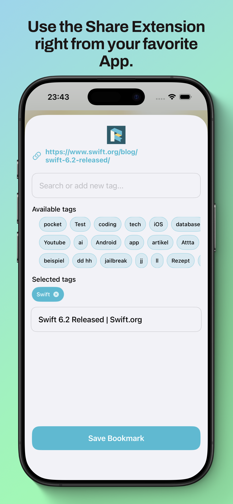
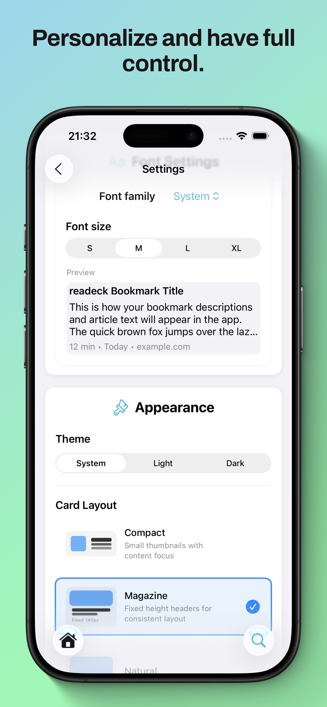
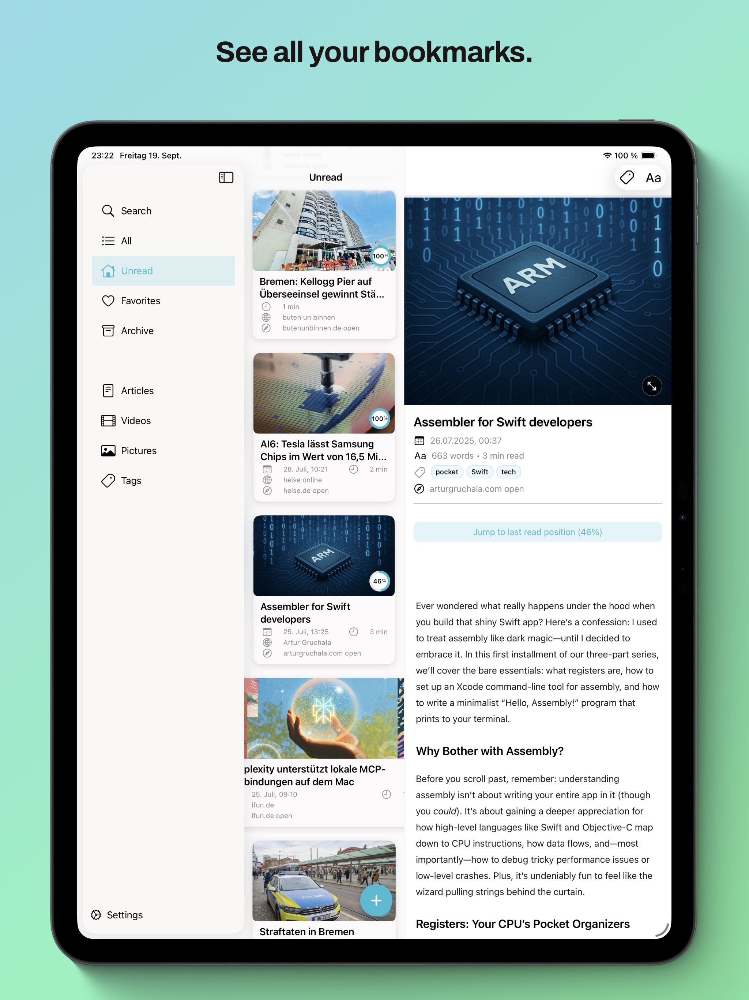
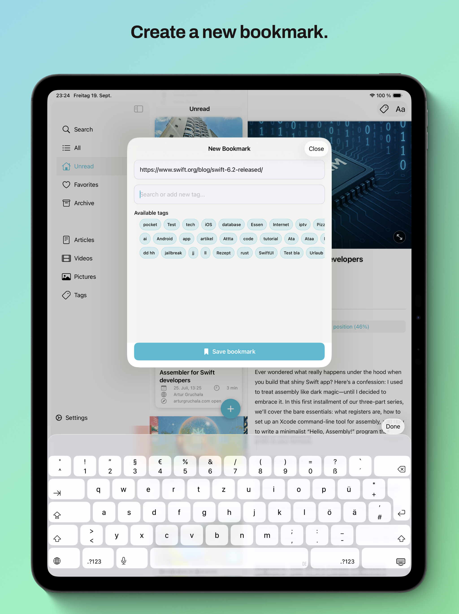
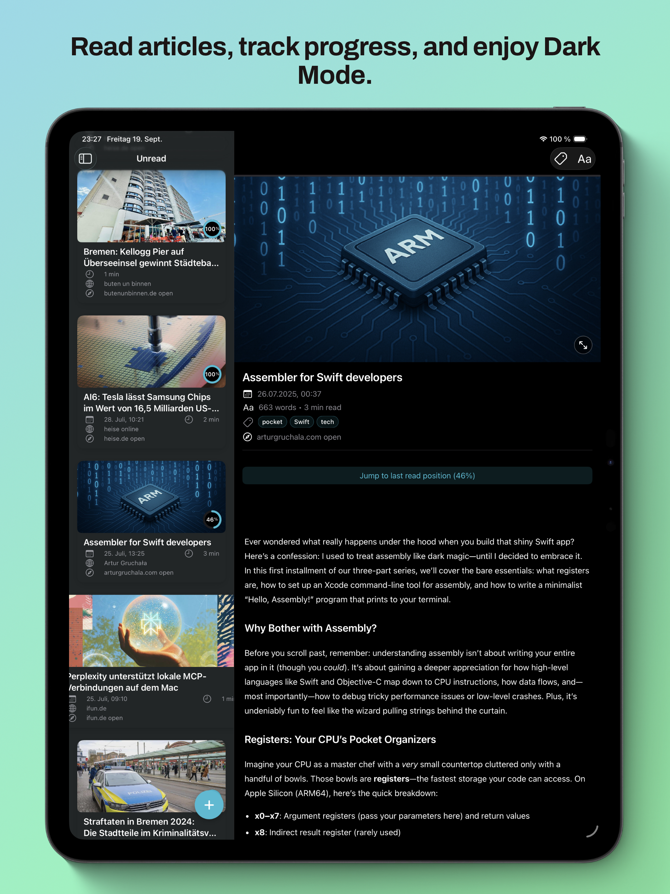
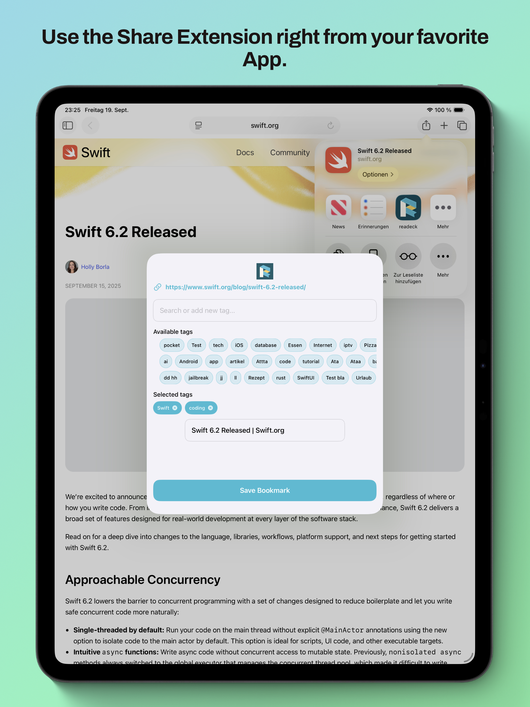
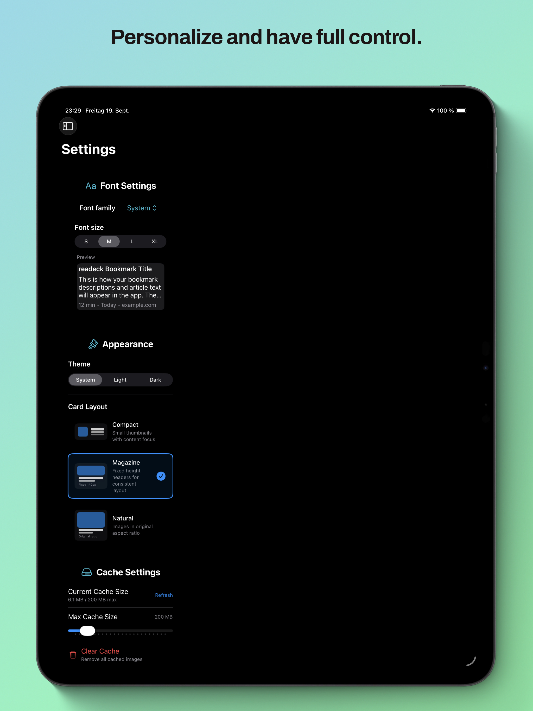

# Readeck iOS App

A native iOS client for [readeck](https://readeck.org) bookmark management.

The official repository is on Codeberg:
https://codeberg.org/readeck/readeck

## Screenshots

### iPhone

  
  
  
  
  
  

### iPad

  
  
  
  
  
  

## Download

### App Store (Stable Releases)
The official app is available on the App Store with stable, tested releases:

[Download Readeck on the App Store](https://apps.apple.com/de/app/readeck/id6748764703)

### TestFlight Beta Access (Early Releases)
For early access to new features and beta versions (use with caution):

[Join the Readeck Beta on TestFlight](https://testflight.apple.com/join/cV55mKsR)

To participate, simply install TestFlight from the App Store and open the link above on your iPhone, iPad, or Mac. This early version lets you explore all core features before the official release. Your feedback is incredibly valuable and will help shape the final app.

What to test:
- See the feature list below for an overview of what you can try out.
- For details and recent changes, please refer to the release notes in TestFlight or the [Changelog](./CHANGELOG.md).

Please report any bugs, crashes, or suggestions directly through TestFlight, or email me at ilhallak@gmail.com. Thank you for helping make Readeck better!

If you are interested in joining the internal beta, please contact me directly at mooonki:matrix.org.

## Core Features

- Browse and manage bookmarks (All, Unread, Favorites, Archive, Article, Videos, Pictures)
- Share Extension for adding URLs from Safari and other apps
- Swipe actions for quick bookmark management
- Native iOS design with Dark Mode support
- Full iPad Support with Multi-Column Split View
- Font Customization
- Article View with Reading Time and Word Count
- Search functionality
- Support for reading progress
- Save bookmarks when server is unavailable and sync when reconnected

## Configuration

After installing the app:

1. Open the readeck app
2. Enter your readeck server URL and credentials
3. The app will automatically load your bookmarks

Notice: Local Network Addresses are supported. If you use external Domains, you need to add a HTTPS Certificate to your readeck server. Apple does not allow to use HTTP on iOS for external domains in release versions. If you want to use HTTP, you are free to use the beta version of the app, where the HTTP is supported.

## Share Extension

The app includes a Share Extension that allows adding bookmarks directly from Safari:

1. Share any webpage in Safari
2. Select "readeck" from the share sheet
3. Enter a title if you want and hit save
4. The bookmark is automatically added to your collection

## Versions

[see Changelog](./CHANGELOG.md)

## Contributing

1. Fork the repository
2. Create a feature branch (`git checkout -b feature/amazing-feature`)
3. Commit your changes (`git commit -m 'Add amazing feature'`)
4. Push to the branch (`git push origin feature/amazing-feature`)
5. Open a Pull Request
