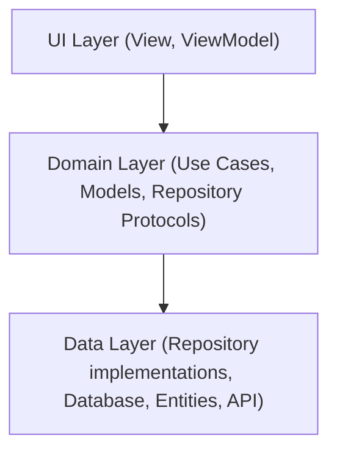

// SPDX-License-Identifier: MIT

# Architecture Overview: readeck client

## 1. Introduction

**readeck client** is an open-source iOS project for conveniently managing and reading bookmarks. The app uses the MVVM architecture pattern and follows a clear layer structure: **UI**, **Domain**, and **Data**. A key feature is its own dependency injection (DI) based on Swift protocols and the factory pattern—completely without external libraries.

- **Architecture Pattern:** MVVM (Model-View-ViewModel) + Use Cases
- **Layers:** UI, Domain, Data
- **Technologies:** Swift, SwiftUI, CoreData, custom DI
- **DI:** Protocol-based, factory pattern, no external libraries

## 2. Architecture Overview



**Layer Overview:**

| Layer   | Responsibility |
|---------|----------------------|
| UI      | Presentation, user interaction, ViewModels, bindings |
| Domain  | Business logic, use cases, models, repository protocols |
| Data    | Repository implementations, database, entities, API |

## 3. Dependency Injection (DI)

**Goal:** Loose coupling, better testability, exchangeability of implementations.

**Approach:**
- Define protocols for dependencies (e.g., repository protocols)
- Implement the protocols in concrete classes
- Provide dependencies via a central factory
- Pass dependencies to ViewModels/use cases via initializers

**Example:**

```swift
// 1. Protocol definition
protocol PBookmarksRepository {
    func getBookmarks() async throws -> [Bookmark]
}

// 2. Implementation
class BookmarksRepository: PBookmarksRepository {
    func getBookmarks() async throws -> [Bookmark] {
        // ...
    }
}

// 3. Factory
class DefaultUseCaseFactory {
    let bookmarksRepository: PBookmarksRepository = BookmarksRepository()
    func makeGetBookmarksUseCase() -> GetBookmarksUseCase {
        GetBookmarksUseCase(bookmarksRepository: bookmarksRepository)
    }
}

// 4. ViewModel
class BookmarksViewModel: ObservableObject {
    private let getBookmarksUseCase: GetBookmarksUseCase
    init(factory: DefaultUseCaseFactory) {
        self.getBookmarksUseCase = factory.makeGetBookmarksUseCase()
    }
}
```

**Advantages:**
- Exchangeability (e.g., for tests)
- No dependency on frameworks
- Central management of all dependencies

## 4. Component Description

| Component           | Responsibility |
|---------------------|---------------|
| View                | UI elements, presentation, user interaction |
| ViewModel           | Bridge between View & Domain, state management |
| Use Case            | Encapsulates a business logic (e.g., create bookmark) |
| Repository Protocol | Interface between Domain & Data layer |
| Repository Implementation | Concrete implementation of repository protocols, handles data access |
| Data Source / API   | Access to external data sources (API, CoreData, Keychain) |
| Model/Entity        | Represents core data structures |
| Dependency Factory  | Creates and manages dependencies, central DI point |

## 5. Data Flow

1. **User interaction** in the view triggers an action in the ViewModel.
2. The **ViewModel** calls a **use case**.
3. The **use case** uses a **repository protocol** to load/save data.
4. The **repository implementation** accesses a **data source** (e.g., API, CoreData).
5. The response flows back up to the view and is displayed.

## 6. Advantages of this Architecture

- **Testability:** Protocols and DI allow components to be tested in isolation.
- **Maintainability:** Clear separation of concerns, easy extensibility.
- **Modularity:** Layers can be developed and adjusted independently.
- **Independence:** No dependency on external DI or architecture frameworks.

## 7. Contributor Tips

- **New dependencies:** Always define as a protocol and register in the factory.
- **Protocols:** Define in the domain layer, implement in the data layer.
- **Factory:** Extend the factory for new use cases or repositories.
- **No external frameworks:** Intentionally use custom solutions for better control and clarity.

## 8. Glossary

| Term                | Definition |
|---------------------|------------|
| Dependency Injection| Technique for providing dependencies from the outside |
| Protocol            | Swift interface that defines requirements for types |
| Factory Pattern     | Design pattern for central object creation |
| MVVM                | Architecture: Model-View-ViewModel |
| Use Case            | Encapsulates a specific business logic |
| Repository Protocol | Interface in the domain layer for data access |
| Repository Implementation | Concrete class in the data layer that fulfills a repository protocol |
| Data Source         | Implementation for data access (API, DB, etc.) |
| Model/Entity        | Core data structure used in domain or data layer |

## 9. Recommended Links

- [Clean Architecture (Uncle Bob)](https://blog.cleancoder.com/uncle-bob/2012/08/13/the-clean-architecture.html)
- [Clean Architecture for Swift/iOS (adrian bilescu)](https://adrian-bilescu.medium.com/a-pragmatic-guide-to-clean-architecture-on-ios-e58d19d00559)
- [Swift.org: Protocols](https://docs.swift.org/swift-book/documentation/the-swift-programming-language/protocols/)