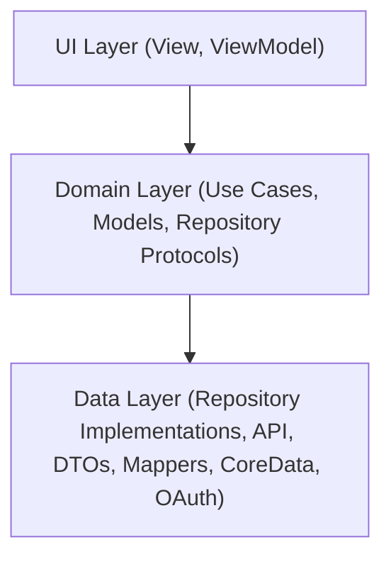
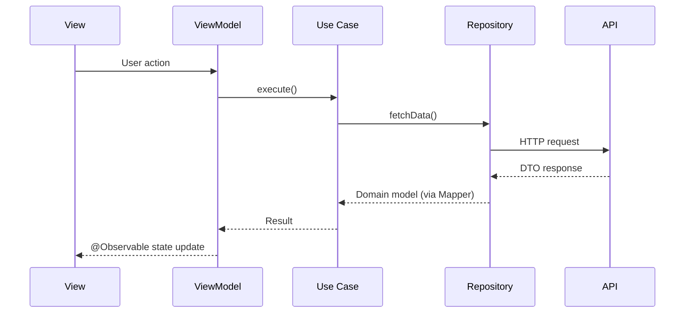

# Architecture Overview: readeck client

## 1. Introduction

**readeck client** is an open-source iOS project for conveniently managing and reading bookmarks. The app uses the MVVM architecture pattern and follows a clear layer structure: **UI**, **Domain**, and **Data**. A key feature is its own dependency injection (DI) based on Swift protocols and the factory pattern—completely without external libraries.

- **Architecture Pattern:** MVVM (Model-View-ViewModel) + Use Cases
- **Layers:** UI, Domain, Data
- **Technologies:** Swift, SwiftUI, CoreData, custom DI
- **DI:** Protocol-based, factory pattern, no external libraries
- **Minimum Deployment:** iOS 17.0+

## 2. Architecture Overview


```mermaid
graph TD
  UI["UI Layer (View, ViewModel)"]
  Domain["Domain Layer (Use Cases, Models, Repository Protocols)"]
  Data["Data Layer (Repository Implementations, API, DTOs, Mappers, CoreData, OAuth)"]
  UI --> Domain
  Domain --> Data
```

**Layer Overview:**

| Layer   | Responsibility |
|---------|----------------------|
| UI      | Presentation, user interaction, ViewModels (`@Observable`), SwiftUI Views |
| Domain  | Business logic, use cases, models, repository protocols, error types |
| Data    | Repository implementations, API client, DTOs, DTO-to-Domain mappers, CoreData, OAuth |

## 3. Dependency Injection (DI)

**Goal:** Loose coupling, better testability, exchangeability of implementations.

**Approach:**
- Define protocols for dependencies (e.g., repository protocols in Domain layer)
- Implement the protocols in concrete classes (Data layer)
- Provide dependencies via a central factory singleton
- Pass the factory protocol to ViewModels via initializers (default: `DefaultUseCaseFactory.shared`)

**Key components:**
- `UseCaseFactory` — Protocol defining all factory methods
- `DefaultUseCaseFactory` — Production implementation (singleton)
- `MockUseCaseFactory` — Test implementation with mock use cases

**Example:**

```swift
// 1. Factory Protocol
protocol UseCaseFactory {
    func makeGetBookmarksUseCase() -> PGetBookmarksUseCase
    func makeUpdateBookmarkUseCase() -> PUpdateBookmarkUseCase
    // ...
}

// 2. Production Factory (singleton, lazy repositories)
final class DefaultUseCaseFactory: UseCaseFactory {
    static let shared = DefaultUseCaseFactory()

    private lazy var api: PAPI = API(tokenProvider: tokenProvider)
    private lazy var bookmarksRepository: PBookmarksRepository = BookmarksRepository(api: api)

    private init() {}

    func makeGetBookmarksUseCase() -> PGetBookmarksUseCase {
        GetBookmarksUseCase(repository: bookmarksRepository)
    }
}

// 3. Mock Factory (for testing/previews)
class MockUseCaseFactory: UseCaseFactory {
    func makeGetBookmarksUseCase() -> PGetBookmarksUseCase {
        MockGetBookmarksUseCase()
    }
}

// 4. ViewModel (accepts factory protocol, defaults to production singleton)
@Observable
class BookmarksViewModel {
    private let getBookmarksUseCase: PGetBookmarksUseCase

    init(_ factory: UseCaseFactory = DefaultUseCaseFactory.shared) {
        self.getBookmarksUseCase = factory.makeGetBookmarksUseCase()
    }
}
```

**Important:** All repositories are created once as `lazy var` properties and shared across use cases. Do not create new repository or API instances inside factory methods.

## 4. Component Description

| Component           | Responsibility |
|---------------------|---------------|
| View                | SwiftUI structs, presentation, user interaction |
| ViewModel           | Bridge between View & Domain, state management (`@Observable`) |
| Use Case            | Encapsulates a business logic operation, protocol-based (`P` prefix) |
| Repository Protocol | Interface between Domain & Data layer (defined in Domain) |
| Repository Impl     | Concrete data access implementation (in Data layer) |
| DTO                 | Data Transfer Objects from API responses (`Data/API/DTOs/`) |
| Mapper              | Extensions on DTOs converting to Domain models (`Data/Mappers/`) |
| API Client          | Network layer handling HTTP requests (`Data/API/`) |
| Model/Entity        | Core domain data structures (`Domain/Model/`) |
| Dependency Factory  | Creates and manages dependencies via `UseCaseFactory` protocol |

## 5. Data Flow


```mermaid
sequenceDiagram
    participant V as View
    participant VM as ViewModel
    participant UC as Use Case
    participant R as Repository
    participant A as API

    V->>VM: User action
    VM->>UC: execute()
    UC->>R: fetchData()
    R->>A: HTTP request
    A-->>R: DTO response
    R-->>UC: Domain model (via Mapper)
    UC-->>VM: Result
    VM-->>V: @Observable state update
```

1. **User interaction** in the View triggers an action in the ViewModel.
2. The **ViewModel** calls a **Use Case** via its protocol.
3. The **Use Case** uses a **Repository Protocol** to load/save data.
4. The **Repository** calls the **API client**, receives DTOs, and maps them to Domain models.
5. The response flows back up to the ViewModel, which updates its `@Observable` state.
6. SwiftUI automatically re-renders the View.

## 6. Navigation

The app adapts its navigation based on device type:

| Device | Implementation | Pattern |
|--------|---------------|---------|
| iPhone | `PhoneTabView` | Tab bar with NavigationStack per tab |
| iPad   | `PadSidebarView` | NavigationSplitView with sidebar, content, and detail |

Both share the same ViewModels and business logic. Device detection happens in `MainTabView`.

## 7. Advantages of this Architecture

- **Testability:** `UseCaseFactory` protocol enables swapping production code for mocks.
- **Maintainability:** Clear separation of concerns, easy extensibility.
- **Modularity:** Layers can be developed and adjusted independently.
- **Independence:** No dependency on external DI or architecture frameworks.

## 8. Contributor Tips

- **New Use Cases:** Define a protocol (`P` prefix), implement the class, add a factory method to both `UseCaseFactory` protocol and `DefaultUseCaseFactory` (+ `MockUseCaseFactory`).
- **New Repositories:** Define protocol in Domain layer, implement in Data layer, add as `private lazy var` in `DefaultUseCaseFactory`. Do not create new instances per factory method call.
- **DTOs & Mapping:** API responses are decoded into DTOs, then mapped to Domain models via extensions in `Data/Mappers/`.
- **No external frameworks:** Intentionally use custom solutions for better control and clarity.

## 9. Glossary

| Term                | Definition |
|---------------------|------------|
| Dependency Injection| Technique for providing dependencies from the outside |
| Protocol            | Swift interface that defines requirements for types |
| Factory Pattern     | Design pattern for central object creation |
| MVVM                | Architecture: Model-View-ViewModel |
| @Observable         | Swift macro (iOS 17+) for automatic change tracking in ViewModels |
| Use Case            | Encapsulates a specific business logic operation |
| Repository Protocol | Interface in the domain layer for data access |
| Repository Impl     | Concrete class in the data layer that fulfills a repository protocol |
| DTO                 | Data Transfer Object — raw API response model |
| Mapper              | Converts DTOs to Domain models |
| Data Source         | Implementation for data access (API, CoreData, Keychain) |

## 10. Recommended Links

- [Clean Architecture (Uncle Bob)](https://blog.cleancoder.com/uncle-bob/2012/08/13/the-clean-architecture.html)
- [Clean Architecture for Swift/iOS (Adrian Bilescu)](https://adrian-bilescu.medium.com/a-pragmatic-guide-to-clean-architecture-on-ios-e58d19d00559)
- [Swift.org: Protocols](https://docs.swift.org/swift-book/documentation/the-swift-programming-language/protocols/)
